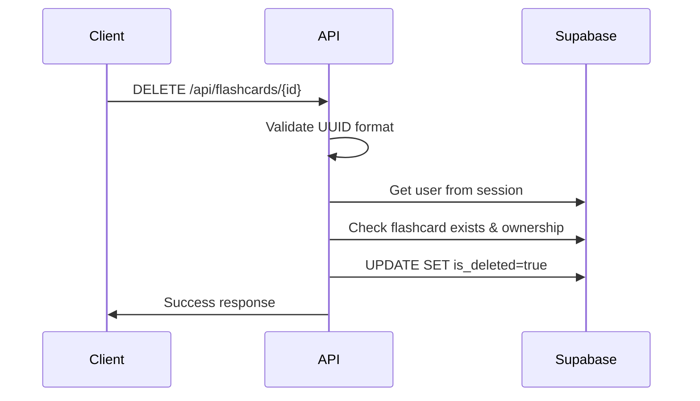

# API Endpoint Implementation Plan: Delete Flashcard

## 1. Przegląd punktu końcowego

Endpoint służy do miękkiego usuwania (soft delete) fiszki należącej do zalogowanego użytkownika. Operacja oznacza fiszkę jako usuniętą poprzez ustawienie flagi `is_deleted = true`, zachowując przy tym dane w bazie dla celów audytu i potencjalnego przywracania.

## 2. Szczegóły żądania

- **Metoda HTTP**: DELETE
- **Struktura URL**: `/api/flashcards/{id}`
- **Parametry**:
  - **Wymagane**: `id` (UUID fiszki w ścieżce URL)
  - **Opcjonalne**: brak
- **Request Body**: brak
- **Headers**: Authorization header z session token (zarządzany przez Supabase Auth)

## 3. Wykorzystywane typy

```typescript
// Już zdefiniowane w types.ts
interface DeleteFlashcardCommand {
  id: string;
  user_id: string;
}

interface SuccessResponse {
  success: true;
  message: string;
}

// Walidacja (już zdefiniowana w flashcard-schemas.ts)
const UuidPathParamSchema = z.object({
  id: z.string().uuid("Invalid flashcard ID format"),
});
```

## 4. Szczegóły odpowiedzi

### Sukces (200 OK)

```json
{
  "success": true,
  "message": "Flashcard deleted successfully"
}
```

### Błędy

- **400 Bad Request**: Nieprawidłowy format UUID
- **401 Unauthorized**: Brak uwierzytelnienia
- **404 Not Found**: Fiszka nie istnieje lub została już usunięta
- **500 Internal Server Error**: Błąd serwera

## 5. Przepływ danych

1. **Walidacja parametrów**: Sprawdzenie czy `id` to prawidłowy UUID
2. **Uwierzytelnienie**: Pobranie `user_id` z Supabase session
3. **Sprawdzenie istnienia**: Weryfikacja czy fiszka istnieje i należy do użytkownika
4. **Soft delete**: Ustawienie `is_deleted = true` i `updated_at = now()`
5. **Odpowiedź**: Zwrócenie komunikatu sukcesu



## 6. Względy bezpieczeństwa

- **Row Level Security (RLS)**: Supabase RLS automatycznie filtruje fiszki według `user_id`
- **Session validation**: Weryfikacja aktywnej sesji użytkownika
- **UUID validation**: Walidacja formatu UUID zapobiega injection attacks
- **Soft delete**: Zachowanie danych dla audytu i zgodności z RODO
- **CORS**: Konfiguracja dla dozwolonych domen

## 7. Obsługa błędów

| Scenariusz          | Kod HTTP | Odpowiedź                                                      |
| ------------------- | -------- | -------------------------------------------------------------- |
| Nieprawidłowy UUID  | 400      | `{ "success": false, "error": "Invalid flashcard ID format" }` |
| Brak sesji          | 401      | `{ "success": false, "error": "Authentication required" }`     |
| Fiszka nie istnieje | 404      | `{ "success": false, "error": "Flashcard not found" }`         |
| Fiszka już usunięta | 404      | `{ "success": false, "error": "Flashcard not found" }`         |
| Błąd bazy danych    | 500      | `{ "success": false, "error": "Internal server error" }`       |

## 8. Rozważania dotyczące wydajności

- **Indeks na user_id**: Wykorzystanie istniejącego indeksu `idx_flashcards_user_created_at`
- **Soft delete**: Minimalne obciążenie - tylko UPDATE jednego rekordu
- **RLS**: Wbudowana optymalizacja Supabase dla filtrowania na poziomie wiersza
- **Connection pooling**: Wykorzystanie wbudowanego poolingu Supabase
- **Caching**: Brak konieczności cache'owania dla operacji DELETE

## 9. Etapy wdrożenia

### 1. Stworzenie service layer

```typescript
// src/lib/services/flashcard.service.ts
export async function deleteFlashcard(supabase: SupabaseClient, command: DeleteFlashcardCommand);
```

### 2. Implementacja endpoint handler

```typescript
// src/pages/api/flashcards/[id].ts
export async function DELETE(context: APIContext);
```

### 3. Walidacja parametrów

- Użycie `UuidPathParamSchema` do walidacji `id`
- Obsługa błędów walidacji z odpowiednimi komunikatami

### 4. Integracja z Supabase

- Pobranie klienta Supabase z `context.locals`
- Implementacja logiki soft delete z właściwą obsługą błędów

## 10. Dodatkowe rozważania

### Monitoring i logowanie

- Logowanie operacji delete dla audytu
- Metryki: liczba usuniętych fiszek na użytkownika
- Alerting przy nietypowo wysokiej liczbie usunięć

### Przyszłe rozszerzenia

- Batch delete dla wielu fiszek jednocześnie
- Undo functionality (przywracanie usuniętych fiszek)
- Automatyczne hard delete po określonym czasie

### Zgodność z RODO

- Możliwość rzeczywistego usunięcia danych na żądanie
- Logowanie operacji zgodnie z wymogami audytu
