# Diagram Architektury UI - Moduł Autentykacji 10xCards

## Analiza Architektury

Na podstawie analizy specyfikacji modułu logowania i rejestracji oraz istniejących komponentów, zidentyfikowano następujące elementy:

### Komponenty wymienione w specyfikacji:

**Nowe strony Astro:**

- `login.astro` - Strona logowania z integracją AuthForm
- `register.astro` - Strona rejestracji z walidacją email/hasło
- `forgot-password.astro` - Strona odzyskiwania hasła
- `reset-password.astro` - Strona resetowania hasła z tokenem
- `dashboard.astro` - Pulpit użytkownika (główna strona po zalogowaniu)
- `profile.astro` - Strona profilu użytkownika

**Nowe komponenty React:**

- `AuthForm.tsx` - Uniwersalny formularz obsługujący 4 tryby (login, register, forgot-password, reset-password)
- `AuthLayout.tsx` - Layout dla stron autentykacji z centralnym pozycjonowaniem
- `LoginForm.tsx/RegisterForm.tsx` - Dedykowane formularze z walidacją
- `UserProfile.tsx` - Komponent zarządzania profilem i usuwania konta
- `AuthGuard.tsx` - HOC ochrony tras wymagających autentykacji
- `SavePromptModal.tsx` - Modal dla niezalogowanych próbujących zapisać fiszki

**Rozszerzone komponenty nawigacji:**

- `Navigation.tsx` - Główna nawigacja z różnymi widokami dla zalogowanych/niezalogowanych
- `AuthButton.tsx` - Przycisk login/logout w prawym górnym rogu
- `UserMenu.tsx` - Dropdown menu z profilem i wylogowaniem

### Główne strony i ich komponenty:

1. **Strony Auth (`/auth/*`)** - wykorzystują AuthLayout.tsx z odpowiednimi formularzami
2. **Dashboard (`/dashboard`)** - główny widok po zalogowaniu z szybkim dostępem do funkcji
3. **Strona główna (/)** - różne widoki dla zalogowanych (przekierowanie) vs niezalogowanych (linki auth)
4. **Generate (`/generate`)** - integracja z SavePromptModal dla niezalogowanych

### Przepływ danych między komponentami:

- **SessionManager** zarządza globalnym stanem autentykacji i powiadamia komponenty o zmianach
- **TokenManager** automatycznie odświeża tokeny i obsługuje niepoprawne sesje
- **AuthGuard** sprawdza uprawnienia i przekierowuje do `/auth/login` dla nieautoryzowanych
- **SavePromptModal** integruje się z generowaniem fiszek i kieruje do rejestracji/logowania

### Moduły odpowiedzialne za stan aplikacji:

- **SessionManager** - singleton zarządzający sesją użytkownika
- **TokenManager** - obsługa JWT tokenów i odświeżania
- **Middleware Astro** - server-side sprawdzanie sesji i przekazywanie do komponentów

### Podział na komponenty:

**Współdzielone:**

- AuthForm.tsx (obsługuje wszystkie tryby auth)
- AuthLayout.tsx (layout dla wszystkich stron auth)
- Navigation.tsx (wspólna dla całej aplikacji)

**Specyficzne dla stron:**

- Dashboard.tsx (tylko dla `/dashboard`)
- SavePromptModal.tsx (tylko dla `/generate` niezalogowanych)
- UserProfile.tsx (tylko dla `/profile`)

### Zależności autentykacji:

Komponenty wymagające aktualizacji ze względu na nowe wymagania:

- **Layout.astro** - dodanie Navigation.tsx z auth state
- **Welcome.astro** - różne widoki i przekierowanie dla zalogowanych
- **GenerateViewClient.tsx** - integracja z SavePromptModal
- **Middleware** - rozszerzenie o obsługę sesji i tokenów

## Diagram Architektury UI

```mermaid
flowchart TD
    %% Główne layouty i strony
    A["Layout.astro<br/>Główny layout aplikacji"] --> B["Navigation.tsx<br/>Główna nawigacja"]
    A --> C["Welcome.astro<br/>Strona główna"]
    A --> D["Dashboard.astro<br/>Pulpit użytkownika"]

    %% Strony autentykacji
    E["AuthLayout.tsx<br/>Layout stron auth"] --> F["login.astro<br/>Strona logowania"]
    E --> G["register.astro<br/>Strona rejestracji"]
    E --> H["forgot-password.astro<br/>Odzyskiwanie hasła"]
    E --> I["reset-password.astro<br/>Reset hasła"]

    %% Komponenty nawigacji
    B --> J["AuthButton.tsx<br/>Przycisk login/logout"]
    B --> K["UserMenu.tsx<br/>Menu użytkownika"]

    %% Formularze autentykacji
    L["AuthForm.tsx<br/>Uniwersalny formularz auth"] --> M["LoginForm.tsx<br/>Formularz logowania"]
    L --> N["RegisterForm.tsx<br/>Formularz rejestracji"]
    L --> O["ForgotPasswordForm.tsx<br/>Formularz odzyskiwania"]
    L --> P["ResetPasswordForm.tsx<br/>Formularz resetu"]

    %% Komponenty dashboard
    D --> Q["Dashboard.tsx<br/>Komponent pulpitu"]
    Q --> R["WelcomeBanner.tsx<br/>Banner powitalny"]
    Q --> S["QuickActions.tsx<br/>Szybkie akcje"]

    %% Komponenty ochrony i profilu
    T["AuthGuard.tsx<br/>Ochrona tras"] --> U["UserProfile.tsx<br/>Profil użytkownika"]
    T --> V["DeleteAccountModal.tsx<br/>Modal usuwania konta"]

    %% Integracja z generowaniem fiszek
    W["GenerateViewClient.tsx<br/>Generowanie fiszek"] --> X["SavePromptModal.tsx<br/>Modal logowania dla zapisywania"]

    %% Zarządzanie sesją
    Y["SessionManager<br/>Zarządzanie sesją"] --> Z["TokenManager<br/>Zarządzanie tokenami"]
    Y --> AA["Middleware<br/>Obsługa auth w Astro"]

    %% Relacje między komponentami
    F --> M
    G --> N
    H --> O
    I --> P

    J -.-> F
    K -.-> U

    B --> C
    B --> D

    X -.-> F
    X -.-> G

    T --> D
    T --> Q

    %% Grouping logiczny
    subgraph "Strony Auth"
        F
        G
        H
        I
        E
    end

    subgraph "Komponenty Auth"
        L
        M
        N
        O
        P
    end

    subgraph "Nawigacja"
        B
        J
        K
    end

    subgraph "Dashboard"
        D
        Q
        R
        S
    end

    subgraph "Zarządzanie Sesją"
        Y
        Z
        AA
    end

    subgraph "Ochrona i Profil"
        T
        U
        V
    end

    subgraph "Integracja Fiszek"
        W
        X
    end

    %% Przepływ stanów
    Y --> B
    Y --> T
    Y --> X

    classDef astroPage fill:#ff6b35,stroke:#333,stroke-width:2px,color:#fff
    classDef reactComponent fill:#61dafb,stroke:#333,stroke-width:2px,color:#000
    classDef layoutComponent fill:#9d4edd,stroke:#333,stroke-width:2px,color:#fff
    classDef authComponent fill:#f72585,stroke:#333,stroke-width:2px,color:#fff
    classDef navComponent fill:#4cc9f0,stroke:#333,stroke-width:2px,color:#000
    classDef sessionComponent fill:#7209b7,stroke:#333,stroke-width:2px,color:#fff

    class F,G,H,I,D,C astroPage
    class M,N,O,P,Q,R,S,U,V,W,X,J,K reactComponent
    class A,E layoutComponent
    class L,T authComponent
    class B navComponent
    class Y,Z,AA sessionComponent
```

## Opis kluczowych przepływów

### 1. Przepływ rejestracji/logowania

- Użytkownik → `login.astro/register.astro` → `AuthForm.tsx` → `SessionManager` → Przekierowanie do `/dashboard`

### 2. Przepływ ochrony tras

- Próba dostępu → `AuthGuard.tsx` → Sprawdzenie `SessionManager` → Przekierowanie lub dostęp

### 3. Przepływ zapisywania fiszek (niezalogowany)

- `GenerateViewClient.tsx` → Próba zapisu → `SavePromptModal.tsx` → Przekierowanie do auth

### 4. Przepływ nawigacji

- `Navigation.tsx` sprawdza stan z `SessionManager` → Różne menu dla zalogowanych/niezalogowanych

### 5. Zarządzanie sesją

- `SessionManager` słucha zmian z Supabase Auth → Powiadamia komponenty → Aktualizacja UI
